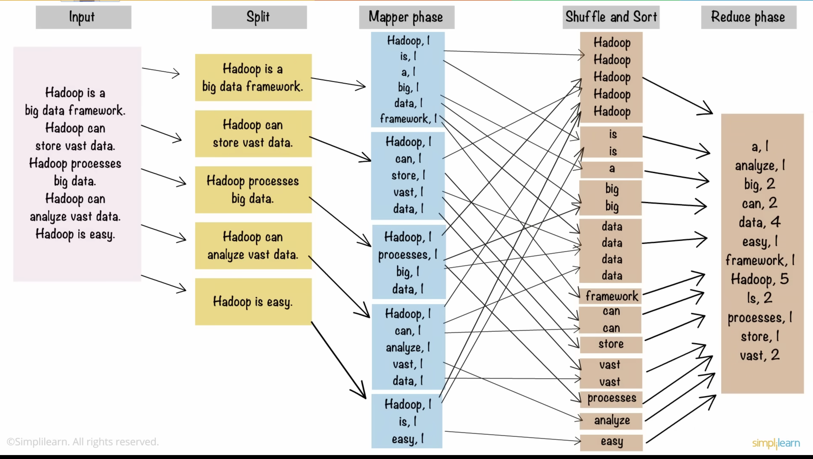

# Big Data Research

## What is Big Data? 

So called 'big data', named simply for its massiveness, is a relatively new resource, very much a by-product of modern technologies. 2005 is given as the year people really started to realise the sheer quantity of data that was being generated by social media platforms, and the power it had. 

Nowadays, big data is not only created by users of internet platforms, but from a host of other technologies, such as smart appliances in the home, and AI devices. Its applications are as varied as its sources. Here are some things big data is used for: 

- Product development
- Medical science
- Social projects 
- Customer experience 
- Fraud & Compliance 
- Innovation
- so many more...

## The V's of big data

1. **Volume** - How much? (there's a lot of it)

2. **Variety** – What type? (many different ones)

3. **Velocity** – How fast? 

4. **Veracity** – How clean? (it might need tidying up a bit)

5. **Variability** – How consistent? (it might not always look like it did yesterday)

6. **Value** – WHY? (it'd better be worth all the effort)

## Challenges in Big Data

- It's big
    - how to store it effectively? 
- It's dirty
    - cleaning it takes up lots ot time & resources
- It's changing
    - new technologies are evolving quickly & it's difficult to stay up to date with new frameworks

## Distributed Systems

Distributed systems are computer systems that consist of multiple computers connected and working together as a single system. They're often used to process large amounts of data or to provide high availability services.

*Before Hadoop,* there were a number of distributed systems that were used for a variety of purposes, including:

- *Distributed file systems*

    These allow multiple computers to access the same set of files as if they were stored on a single computer, making it possible to store and access large amounts of data that would be too large for a single computer. 
    
    Examples include the Network File System (NFS) and the Andrew File System (AFS).

- *Distributed databases*

    Distributed databases allow multiple computers to access the same database as if it were stored on a single computer. This makes it possible to scale database applications to handle large numbers of users and transactions. 
    
    Examples include Oracle RAC and MySQL Cluster.

- *Distributed computing systems*

     These allow multiple computers to work together to solve complex problems, facilitating solving problems that would be too difficult or time-consuming for a single computer to solve on its own. 
     
     Examples include the Berkeley Network Distributed System (Beowulf) and the SETI@home project.

However, these distributed systems were not well-suited for dealing with big data for a number of reasons:

1. **Complexity**
    
    Distributed systems can be complex to design, implement, and manage. This can make them difficult to use for big data applications, which often need to be scaled up to handle very large amounts of data.

2. **Scalability**

    Some distributed systems are not well-suited for scaling to very large numbers of nodes. This can limit their ability to process very large datasets.

3. **Cost**

    Distributed systems can be expensive to deploy and maintain. This can make them cost-prohibitive for some big data applications.

## Hadoop: a Solution (for now)

Hadoop was designed to address these challenges. It is a distributed computing framework that is specifically designed for processing large datasets. 

It was created in 2005 (remember that year we mentioned earlier, when the massiveness of data began to dawn on people).

Hadoop is easy to use, scalable, and cost-effective. This has made it the most popular distributed computing platform for big data applications.

Here are some specific examples of how Hadoop is better suited for big data than previous distributed systems:

1. Hadoop is more scalable. 
    
    Hadoop can scale to thousands or even tens of thousands of nodes. This makes it possible to process very large datasets on a single cluster.

2. Hadoop is more cost-effective. 

    Hadoop can be deployed on commodity hardware, which is much less expensive than specialized high-performance computing hardware.

3. Hadoop is easier to use. 

    Hadoop provides a simple programming model for processing large datasets. This makes it easier for developers to write big data applications.

## Main Components of Hadoop

### HDFS 

Hadoop Distributed File System 

its way of storing big data by distributing it over many computers in blocks of 128MB

Replication Method -> Fault Tolerant

Each block is replicated (ie to a replication factor of 3), so that if one node fails, we don't lose data 

HDFS is also scalable to thousands, or tens of thousands of nodes

### YARN 

"Yet Another Resource Negotiator" 

a resource management framework used to schedule & monitor applications running on a Hadoop cluster

helps manage resources such as Ram, Network Bandwidth, & CPU to enable Hadoop to run multiple jobs simultaneously 

Yarn consists of the following: 

1. Resource Manager (RM) - allocates resources to applications, monitors use, & status of cluster
2. Node Manager (NM) - runs tasks on the nodes in cluster & reports node status to RM
3. Application Master
4. Containers (hold resources in secure, isolated environment)

### MapReduce 

for data processing, splits data up and processes them independently on different data nodes

Individual results are then aggregated to give final output

Here's a visualisation of how Hadoop would process some text input to analyse word count, to demonstate the various stages of MapReduce processing

The Hadoop ecosystem also uses several other components, big data tools & frameworks 

- Hive
- Pig
- Apache Spark
- Flume
- Sqoop
- etc. 